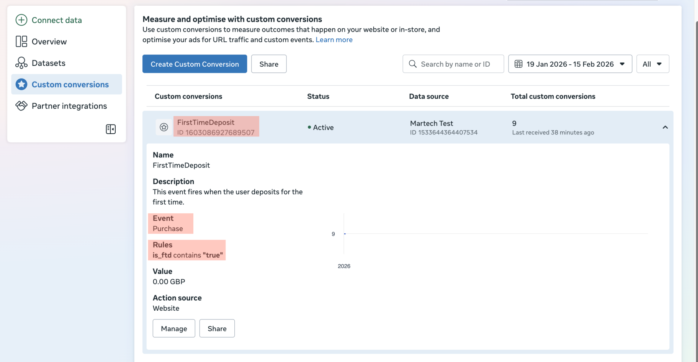

# MarTech Engineer – Assessment

## PART 1 — Strategic Assessment

### Task 1 — Past Project (Short)

_Describe one project where you significantly improved tracking, attribution, or analytics
infrastructure._

#### Analytics Data Governance

While at Spotlight Sports Group, maintaining high data quality was particularly challenging. App feature releases occurred every two weeks and required sign-off on more than 80 tracked events. The process was entirely manual, often taking several days to complete. It was error-prone and frequently delayed releases.

The objectives were to:

1. Reduce sign-off time
1. Increase confidence in data accuracy
1. Identify and resolve issues earlier in the development cycle

I led the introduction of a real-time and automated validation framework for tracked events by:

- Isolating tracking implementations to align with the development lifecycle: development, testing, UAT and production.
- Using JSON schemas that evolved with the tracking requirements.
- Leveraging the schemas to produce stakeholder-friendly living documentation.
- Facilitated a mechanism to amend tracking in-flight when fixing issues at the source was not feasible within the sprint timeframe.

- Designing and maintaining end-to-end automated tests to replace manual validation processes.

As a result:

- Analytics sign-off times were reduced by around 50%, with issues identified much earlier in the release cycle.
- Confidence in tracking increased significantly, both internally and among stakeholders.
- A scalable, flexible solution was established, capable of evolving in line with product and brand development.

_Figure 1: Tracking plans, transformations, and automation_


### Task 2 — Attribution & Decision Making

1. _What are the risks of evaluating performance this way?_

   Assessing performance solely using these metrics risks skewing the results towards low-cost, short-term acquisitions, while overlooking the long-term quality and value of the acquired users as in the example.

   A low CPA may indicate cost efficiency, it doesn't account for whether the acquired user will remain engaged or retain value over time.

   Learning phases usually take 7-10 days before they stabilise.

   Similary D7 ROAS would not suitable for awareness campaigns as these are placed at TOFU.

1. _What would you change to measure performance more accurately?_

I would shift focus from short-term vanity metrics to longer-horizon indicators like D30/D90 revenue, actual LTV, and especially predictive LTV (pLTV), which better captures a user’s long-term value and relationship with the brand. The latter can be expanded into LTV:CAC ratios.

1. _How would you implement this change at a data level_
   - D30, D90, and LTV are usually provided by most MMP
   - Predictive LTV would require modelling based on first-party data

### Task 3 — iOS Attribution (SKAN + AppsFlyer)

1. _How would you integrate this data into internal reporting?_
   1. Leverage Data Locker in AppsFlyer to export data to a storage bucket (e.g.: Google Cloud Storage) or DW (e.g.: BigQuery)

   1. Use Airflow to orchestrate automated workflows that transform the data (e.g.: dbt) into marts

   1. Connect the BI tool (Looker, Power BI, Tableau, etc.) to the marts

1. _How would you avoid double counting?_

   I would leverage AppsFlyer’s 'Single Source of Truth' which combines all attribution methods used by the platform.

1. _What are the main pros and cons of:_
   - _SKAN_
   - _Probabilistic attribution_

   SKAN enables campaign tracking on devices where users have opted out of ATT. However, due to its privacy-centric design, SKAN provides aggregated data instead of user-level insights. Moreover delays of two days or longer is expected. Probabilistic attribution may misattribute and over-report. Probability attribution such as the one offered by AppsFlyer still rely on IP addresses and the model are proprietary so the rules of attribution are not disclosed.

1. _How would this affect LTV measurement?_

Since user-level data is unavailable and conversion data is limited and arrives in different windows, LTV values can't be measured directly. Instead, they are predicted based on early user activity.

## PART 2 — MarTech Technical Assessment

| Container Type | Container Name  | Container ID   | 
| :------------- | :-------------- | :------------- |
| Server         | Brands [Server] | `GTM-PZV4FDG4` |
| Web            | Brands [Client] | `GTM-TSFCWXZZ` |


| Brand Name | URL                       | Meta Pixel ID      |
| :--------- | :------------------------ | :----------------- |
| Brand X    | `brand-x-one.vercel.app`  | `1533644364407534` |
| Brand Y    | `brand-y.vercel.app`      | `2299157367256743` |
| Brand Z    | `brand-y-zioo.vercel.app` | `1514739266263477` |

### Option A

Track two separate events:

- Standard _*Purchase*_
- Custom _*FirstTimeDeposit*_

### Option B

Track a single event _*Purchase*_ and derive _*FirstTimeDeposit*_ from _Custom Conversions_ in event manager based on the event parameters.




```code:json
// Purchase event sample payload 
// Endpoint [POST]: https://server-side-tagging-3phkixd4ta-uc.a.run.app/collect

{
   "event_name":"purchase",
   "event_id":"266375e4-2ce9-4202-b3d9-3de96a6aa57a",
   "event_time":1771247930,
   "action_source":"website",
   "currency":"GBP",
   "value":"5",
   "is_ftd":"true",
   "event_source_url":"https://brand-y-zioo.vercel.app",
   "referrer_url":"https://brand-y-zioo.vercel.app/lp/spinners",
   "user_data":{
      "user_id":"445ef40b-f8e1-4f3f-bb03-f47d93a0875f",
      "last_name":"Last Name",
      "first_name":"First Name",
      "browser_id":"fb.1.1615295627183.1234567890",
      "click_id":"fb.1.1615295627183.1234567890",
      "email":[
         "first_name.last_name@email.io"
      ],
      "phone":[
         "4407711283920"
      ],
      "client_ip_address":"31.48.104.214",
      "client_user_agent":"Mozilla/5.0 (Macintosh; Intel Mac OS X 10_15_7) AppleWebKit/537.36 (KHTML, like Gecko) Chrome/144.0.0.0 Safari/537.36",
      "country":[
         "gb"
      ],
      "county":[
         "midlothian"
      ],
      "postcode":[
         "eh11bb"
      ],
      "city":[
         "edinburgh"
      ],
      "dob":[
         "19700104"
      ]
   }
}

```